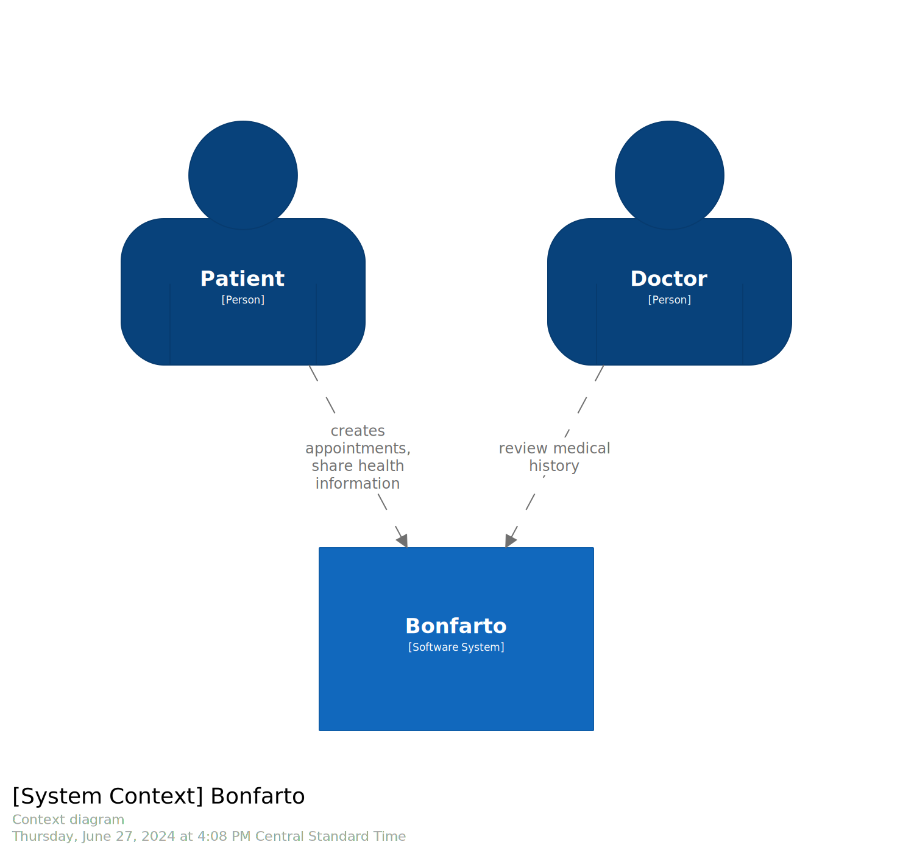
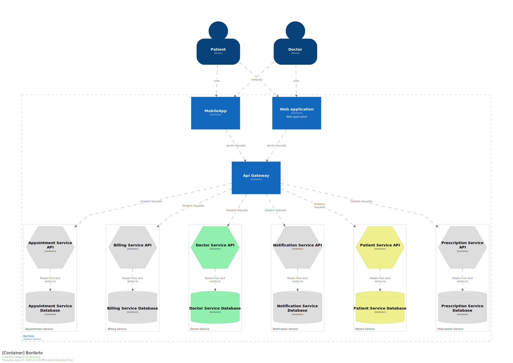

# Bonfarto

Bonfarto is a sample application that consists of a mobile application and a web application, that connects to some backend services.

This is a fictitious application which goal is to be an example of different concepts and technologies:
* Domain Driven Design
* Hexagonal Architecture
* Microservices
* Spring cloud
* Docker
* Kubernates
* C4 model
* Structurizr

#### Backend Services
* [Api Gateway]()
* [Doctors Service](doctor-service/README.md)
* [Patients Service]()
* [Appointments Service]()
* [Billing Service]()
* [Notification Service]()
* [Prescription Service]()

## C4 Diagrams

### System Context

### Containers
